class: middle, center, title-slide
count: false

# Reinforcement learning for life-long microgrid control

An introduction

  

Bertrand Cornélusse 
[bertrand.cornelusse@uliege.be](mailto:bertrand.cornelusse@uliege.be)

---

# Lecture organization

 - Motivation 
 - Markov Decision Processes
 - Reinforcement Learning
 - Lifelong learning for microgrids control
 
---

class: middle
# Motivation

---

# Microgrid (MG) example

.center.width-80[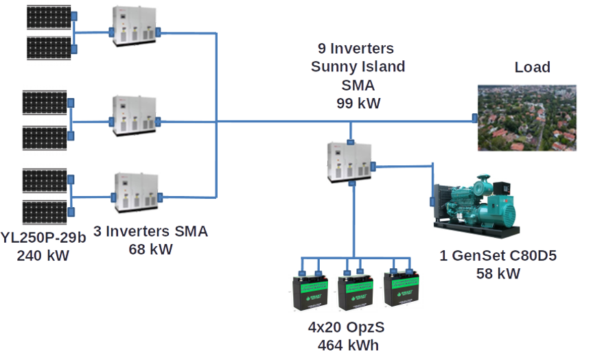]

---

# Energy management principles 

.center.width-80[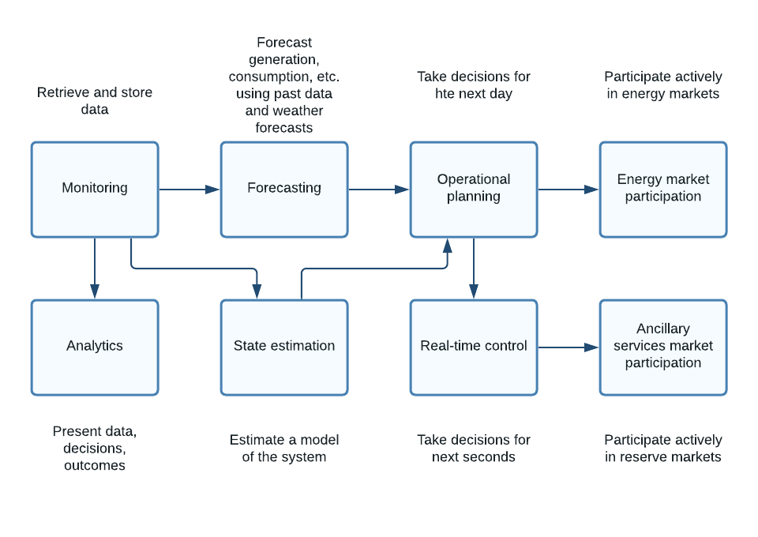]

---

# Let's bring in more AI

.center.width-80[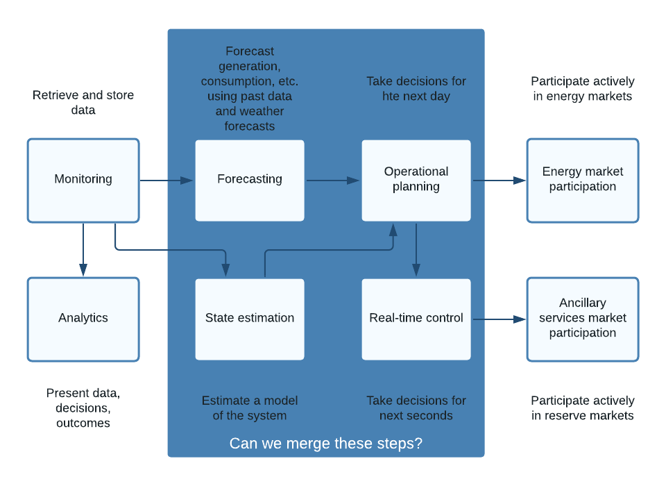]

Why? To further improve automation, especially for small scale grids that evolve a lot with time.

---

class: center, middle

<iframe src="https://giphy.com/embed/Qs28TbxDBLAWyPkji8" width="720" height="480" frameBorder="0" class="giphy-embed" allowFullScreen>

.footnote[Image credits:[GIPHY]("https://giphy.com/gifs/university-bergamo-unibg-Qs28TbxDBLAWyPkji8")]

---

# Goal of this lecture

Assuming you remember notions of *optimization* and *supervised learning*, make you understand the concepts behind the ideas developed in the article 

Totaro, S., Boukas, I., Jonsson, A., & Cornélusse, B. (2021). *Lifelong Control of Off-grid Microgrid with Model-Based Reinforcement Learning*. Energy, 121035.

 - This article proposes a method to learn a model of the MG and its environment 
   - PV conditions, demand evolution
 - uses a simulator to generate data 
   - to avoid relying solely on the actual system 
   - freely available at https://github.com/bcornelusse/microgridRLsimulator
 - uses the learned model to take meta actions 
   - start-stop a generator, charge or discharge a battery
   - relying on simple rules to derive precise set-points.

The learned policy is able to cope with abrupt and gradual changes of the MG and its environment.

---

class: middle, center

To do this I have to introduce concepts of *reinforcement learning*, hence also of *Markov decision processes*.

---

class: middle
# Markov decision processes

This section is a subset of the lecture

 https://glouppe.github.io/info8006-introduction-to-ai/?p=lecture8.md

by my colleague Professor G. Louppe.

---

# Content

.center.width-50[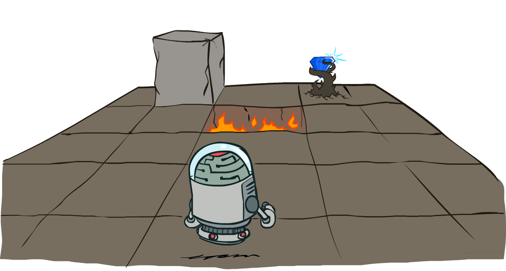]

Reasoning under uncertainty and **taking decisions**:
- Markov decision processes
    - MDPs
    - Bellman equation
    - Value iteration
    - Policy iteration

.footnote[Image credits: [CS188](https://inst.eecs.berkeley.edu/~cs188/), UC Berkeley.]

---

# Grid world

.grid[
.kol-2-3[
Assume our agent lives in a $4 \times 3$ grid environment.
- Noisy movements: actions do not always go as planned.
    - Each action achieves the intended effect with probability $0.8$.
    - The rest of the time, with probability $0.2$, the action moves the agent at right angles to the intented direction.
    - If there is a wall in the direction the agent would have been taken, the agent stays put.
- The agent receives rewards at each time step.
    - Small 'living' reward each step (can be negative).
    - Big rewards come at the end (good or bad).

Goal: maximize sum of rewards.
]
.kol-1-3[     .width-100[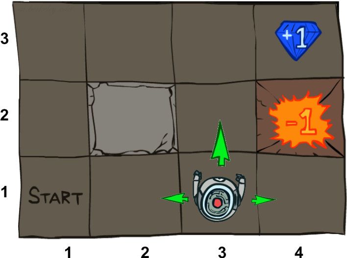]]
]

.footnote[Image credits: [CS188](https://inst.eecs.berkeley.edu/~cs188/), UC Berkeley.]

---

class: middle

.grid.center[
.kol-1-4.center[
Deterministic actions

.width-100[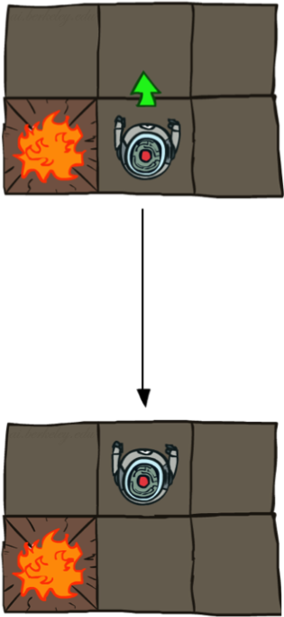]
]
.kol-3-4.center[
Stochastic actions  

.width-90[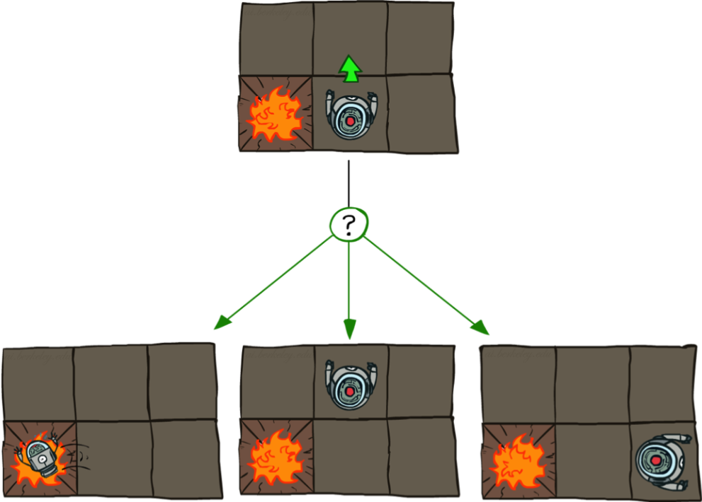]
]
]

.footnote[Image credits: [CS188](https://inst.eecs.berkeley.edu/~cs188/), UC Berkeley.]

---

# Markov decision processes

A **Markov decision process** (MDP) is a tuple $(\mathcal{S}, \mathcal{A}, P, R)$ such that:
- $\mathcal{S}$ is a set of states $s$;
- $\mathcal{A}$ is a set of actions $a$;
- $P$ is a (stationary) transition model such that  $P(s'|s,a)$ denotes the probability of reaching state $s'$ if action $a$ is done in state $s$;
- $R$ is a reward function that maps immediate (finite) reward values $R(s)$ obtained in states $s$.

---

class: middle

.grid[
.kol-1-5.center[
    
$$s'$$
$$r' = R(s')$$
]
.kol-3-5.center[
$$s$$
.width-90[]
$$s' \sim P(s'|s,a)$$
]
.kol-1-5[
     
$$a$$
]
]

---

class: middle

.grid.center[
.kol-1-2[.center.width-70[]]
.kol-1-2[.center.width-70[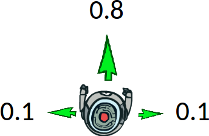]]
]
 

## Example

- $\mathcal{S}$: locations $(i,j)$ on the grid.
- $\mathcal{A}$: $[\text{Up}, \text{Down}, \text{Right}, \text{Left}]$.
- Transition model: $P(s'|s,a)$
- Reward:
$$
R(s) = \begin{cases}
-0.3 & \text{for non-terminal states} \\\\
\pm 1  & \text{for terminal states}
\end{cases}
$$

.footnote[Image credits: [CS188](https://inst.eecs.berkeley.edu/~cs188/), UC Berkeley.]

---

class: middle

.grid[
.kol-3-4[
## What is Markovian about MDPs?

Given the present state, the future and the past are independent:
$$P(s\_{t+1} | s\_t, a\_t, s\_{t-1}, a\_{t-1}, ..., s\_0) = P(s\_{t+1} | s\_t, a\_t)$$
]
.kol-1-4.center[.circle.width-100[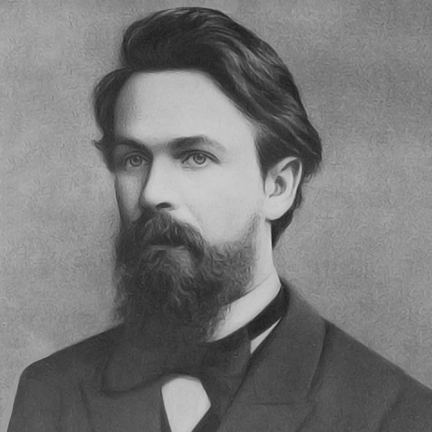]
.caption[Andrey Markov]]
]

---

# Policies

.grid[
.kol-2-3[
- We want to find an optimal **policy** $\pi^* : \mathcal{S} \to \mathcal{A}$.
    - A policy $\pi$ maps states to actions.
    - An optimal policy is one that maximizes the expected utility, e.g. the expected sum of rewards.
    - An explicit policy defines a reflex agent.
]
.kol-1-3[
 
.width-100[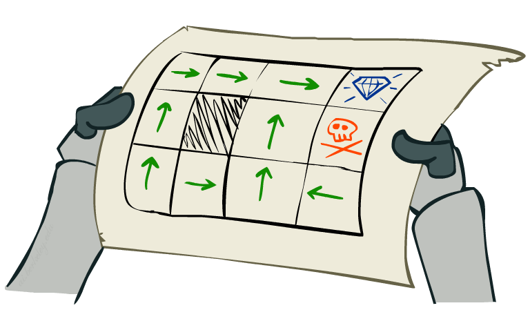]
.center[Optimal policy when $R(s)=-0.3$ for all non-terminal states $s$.]
]
]

.footnote[Image credits: [CS188](https://inst.eecs.berkeley.edu/~cs188/), UC Berkeley.]

---

class: middle

.width-90.center[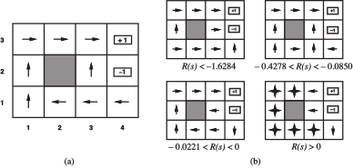]

(a) Optimal policy when $R(s)=-0.04$ for all non-terminal states $s$.
(b) Optimal policies for four different ranges of $R(s)$.

Depending on $R(s)$, the **balance between risk and reward** changes from risk-taking to very conservative.

???

Discuss the balance between risk and rewards.

---

# Utilities over time

.center.width-70[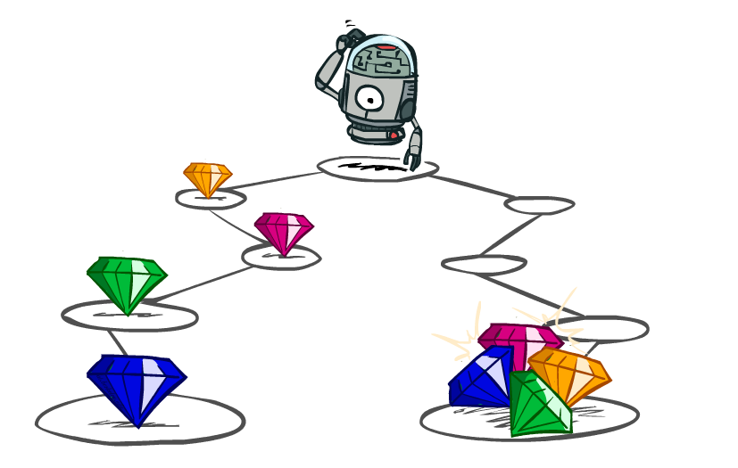]

What preferences should an agent have over state or reward sequences?
- More or less? $[2,3,4]$ or $[1, 2, 2]$?
- Now or later? $[1,0,0]$ or $[0,0,1]$?

.footnote[Image credits: [CS188](https://inst.eecs.berkeley.edu/~cs188/), UC Berkeley.]

---

class: middle

## Theorem

If we assume **stationary** preferences over reward sequences, i.e. such that
$$[r\_0, r\_1, r\_2, ...] \succ [r\_0, r\_1', r\_2', ...] \Rightarrow [r\_1, r\_2, ...] \succ [r\_1', r\_2', ...],$$
then there are only two coherent ways to assign utilities to sequences:

.grid[
.kol-1-3.center[
Additive utility:

Discounted utility: 
($0<\gamma<1$)
]
.kol-2-3[
$V([r\_0, r\_1, r\_2, ...]) = r\_0 + r\_1 + r\_2 + ...$

$V([r\_0, r\_1, r\_2, ...]) = r\_0 + \gamma r\_1 + \gamma^2 r\_2r + ...$
]
]

???

Explain what coherent means.

---

class: middle

.grid[
.kol-1-2[

## Discounting

- Each time we transition to the next state, we multiply in the discount once.
- Why discount?
    - Sooner rewards probably do have higher utility than later rewards.
    - Will help our algorithms converge.
]
.kol-1-2[.width-100[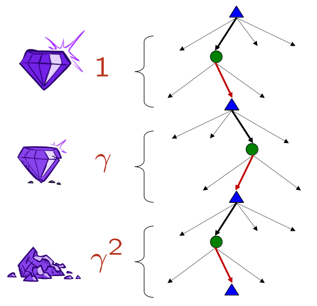]]
]

Example: discount $\gamma=0.5$ 
- $V([1,2,3]) = 1 + 0.5\times 2 + 0.25 \times 3$ 
- $V([1,2,3]) < V([3,2,1])$

.footnote[Image credits: [CS188](https://inst.eecs.berkeley.edu/~cs188/), UC Berkeley.]

---

class: middle

## Infinite sequences

What if the agent lives forever? Do we get infinite rewards? Comparing reward sequences with $+\infty$ utility is problematic.

Solutions:
- Finite horizon: (similar to depth-limited search)
    - Terminate episodes after a fixed number of steps $T$.
    - Results in non-stationary policies ($\pi$ depends on time left).
- Discounting (with $0 < \gamma < 1$ and rewards bounded by $\pm R\_\text{max}$):
    $$V([r\_0, r\_1, ..., r\_\infty]) = \sum\_{t=0}^{\infty} \gamma^t r\_t \leq \frac{R\_\text{max}}{1-\gamma}$$
  Smaller $\gamma$ results in a shorter horizon.
- Absorbing state: guarantee that for every policy, a terminal state will eventually be reached.

---

class: middle

.center.width-25[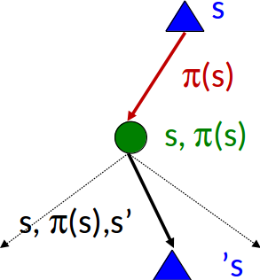]

## Policy evaluation

The expected utility obtained by executing $\pi$ starting in $s$ is given by
$$V^\pi(s) = \mathbb{E}\left[\sum\_{t=0}^\infty \gamma^t R(s\_t) \right]\Biggr\rvert\_{s\_0=s}$$
where the expectation is with respect to the probability distribution over state sequences determined by $s$ and $\pi$.

.footnote[Image credits: [CS188](https://inst.eecs.berkeley.edu/~cs188/), UC Berkeley.]

---

class: middle

## Optimal policies

Among all policies the agent could execute, the **optimal policy** is the policy $\pi\_s^\*$ that maximizes the expected utility:
$$\pi\_s^\* = \arg \max\_\pi V^\pi(s)$$

Because of discounted utilities, the optimal policy is *independent* of the starting state $s$. Therefore we simply write $\pi^\*$.

---

# Values of states

The utility, or value, $V(s)$ of a state is now simply defined as $V^{\pi^\*}(s)$.
- That is, the expected (discounted) reward if the agent executes an optimal policy starting from $s$.
- Notice that $R(s)$ and $V(s)$ are quite different quantities:
    - $R(s)$ is the short term reward for having reached $s$.
    - $V(s)$ is the long term total reward from $s$ onward.

---

class: middle

.center.width-50[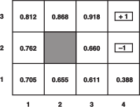]

Utilities of the states in Grid World, calculated with $\gamma=1$ and $R(s)=-0.04$ for non-terminal states.

---

class: middle

.center.width-40[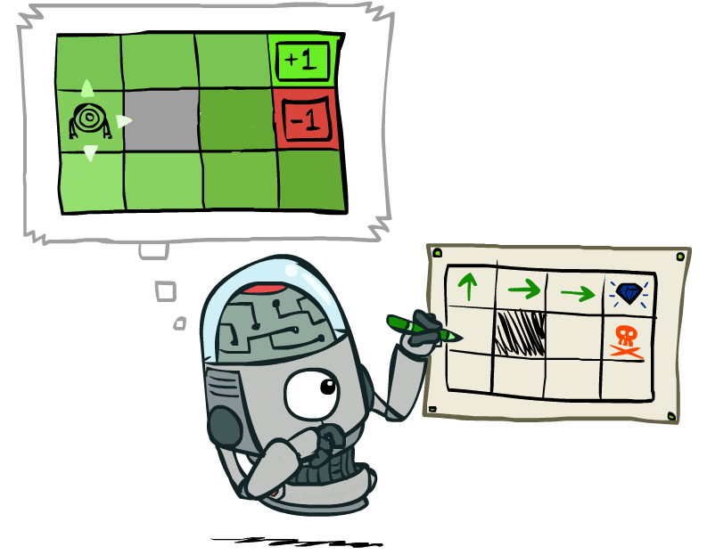]

## Policy extraction

Using the principle of maximum expected utility, the optimal action maximizes the expected utility of the subsequent state.
That is,
$$\pi^\*(s) = \arg \max\_{a} \sum\_{s'} P(s'|s,a) V(s').$$

Therefore, we can extract the optimal policy provided we can estimate the utilities of states.

.footnote[Image credits: [CS188](https://inst.eecs.berkeley.edu/~cs188/), UC Berkeley.]

???

Point out the circularity of the argument!

---

class: middle

$$\pi^\*(s) = \arg \max\_{a} \sum\_{s'} P(s'|s,a) V(s')$$

.center.width-90[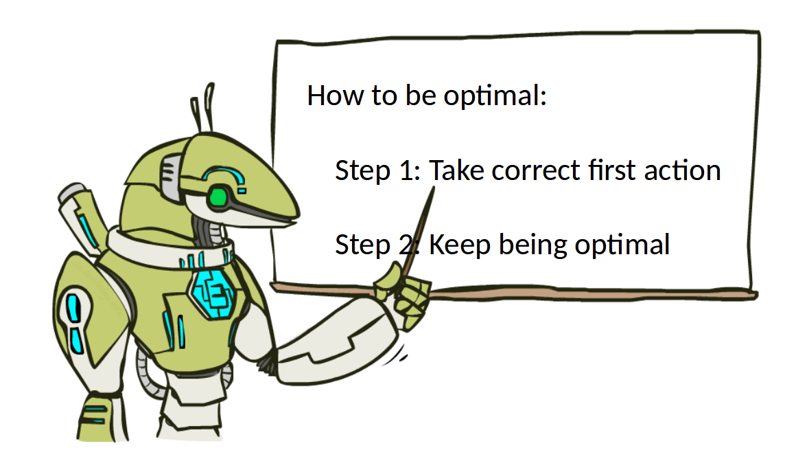]

.footnote[Image credits: [CS188](https://inst.eecs.berkeley.edu/~cs188/), UC Berkeley.]

---

# The Bellman equation

The utility of a state is the immediate reward for that state, plus the expected discounted utility of the next state, assuming that the agent chooses the optimal action:
$$V(s) = R(s) + \gamma  \max\_{a} \sum\_{s'} P(s'|s,a) V(s').$$
- These equations are called the **Bellman equations**. They form a system of $n=|\mathcal{S}|$ non-linear equations with as many unknowns.
- The utilities of states, defined as the expected utility of subsequent state sequences, are solutions of the set of Bellman equations.

???

There is a direct relationship between the utility of a state and the utility of its neighbors.

The Bellman equation combines the expected utility (slide 16) with the policy extraction equation (slide 20).

---

class: middle

## Example

$$
\begin{aligned}
V(1,1) = -0.04 + \gamma \max  [& 0.8 V(1,2) + 0.1 V(2,1) + 0.1 V(1,1), \\\\
    & 0.9 V(1,1) + 0.1 V(1,2), \\\\
    & 0.9 V(1,1) + 0.1 V(2,1), \\\\
    & 0.8 V(2,1) + 0.1 V(1,2) + 0.1 V(1,1)]
\end{aligned}
$$

---

# Value iteration

Because of the $\max$ operator, the Bellman equations are non-linear and solving the system is problematic.

The **value iteration** algorithm provides a fixed-point iteration procedure for computing the state utilities $V(s)$:
- Let $V\_i(s)$ be the estimated utility value for $s$ at the $i$-th iteration step.
- The **Bellman update** consists in updating simultaneously all the estimates to make them *locally consistent* with the Bellman equation:
$$V\_{i+1}(s) = R(s) + \gamma \max\_a \sum\_{s'} P(s'|s,a) V\_i(s') $$
- Repeat until convergence.

---

class: middle

.center.width-100[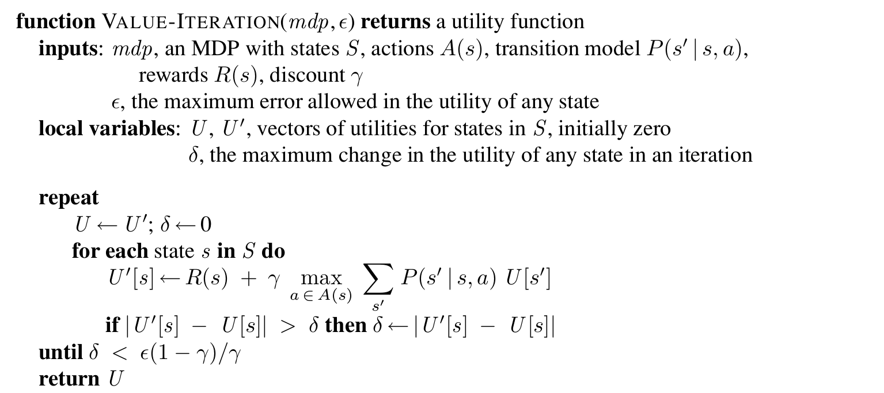]

???

The stopping criterion is based on the fact that if the update is small, then the error is also small. That is, if
$$||V\_{i+1} - V\_i|| < \epsilon (1-\gamma)/\gamma$$
then $$||V\_{i+1}-V||<\epsilon$$

---

class: middle

## Convergence

Let $V\_i$ and $V\_{i+1}$ be successive approximations to the true utility $V$.

.bold[Theorem.] For any two approximations $V\_i$ and $V'\_i$,
$$||V\_{i+1} - V'\_{i+1}||\_\infty \leq \gamma ||V\_i - V'\_i||\_\infty.$$
- The Bellman update is a contraction by $\gamma$ on the space of utility vector.
- Therefore, any two approximations must get closer to each other, and in particular any approximation must get closer to the true $V$.

$\Rightarrow$ **Value iteration always converges to a unique solution of the Bellman equations whenever $\gamma < 1$**.

---

class: middle

## Problems with value iteration

.center.width-30[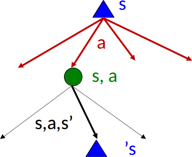]

Value iteration **converges exponentially fast** since $||V\_{i+1} - V||\_\infty \leq \gamma ||V\_i - V||\_\infty$, i.e. the error is reduced by a factor of at least $\gamma$ at each iteration, **but** it repeats the Bellman updates:
$$V\_{i+1}(s) = R(s) + \gamma \max\_a \sum\_{s'} P(s'|s,a) V\_i(s') $$
- Problem 1: it is **slow** – $O(|\mathcal{S}|^2 |\mathcal{A}|)$ per iteration.
- Problem 2: the $\max$ at each state rarely changes.
- Problem 3: the policy $\pi\_i$ extracted from the estimate $V\_i$ might be optimal even if $V\_i$ is inaccurate!

---

# Policy iteration

The **policy iteration** algorithm instead directly computes the policy. µ

It alternates the following two steps:
1. Policy evaluation: given $\pi\_i$, calculate $V\_i = V^{\pi\_i}$, i.e. the utility of each state if $\pi\_i$ is executed.
2. Policy improvement: calculate a new policy $\pi\_{i+1}$ using one-step look-ahead based on $V\_i$:
$$\pi\_{i+1}(s) = \arg\max\_a \sum\_{s'} P(s'|s,a)V\_i(s')$$

This algorithm is still optimal, and might converge (much) faster under some conditions.

---

class: middle

.center.width-25[]

## Policy evaluation

At the $i$-th iteration we have a simplified version of the Bellman equations that relate the utility of $s$ to the utilities of its neighbors:
$$V\_i(s)  = R(s) + \gamma \sum\_{s'} P(s'|s,\pi\_i(s)) V\_i(s')$$
These equations are now **linear** because the $\max$ operator has been removed.
- for $n$ states, we have $n$ equations with $n$ unknowns;
- this can be solved exactly in $O(n^3)$ by standard linear algebra methods.

???

Notice how we replaced $a$ with $\pi\_i(s)$.

---

class: middle

In some cases $O(n^3)$ is too prohibitive. Fortunately, it is not necessary to perform exact policy evaluation. An approximate solution is sufficient.

One way is to run $k$ iterations of simplified Bell updates:
$$V\_{i+1}(s) = R(s) + \gamma \sum\_{s'} P(s'|s,\pi\_i(s))V\_i(s') $$

This hybrid algorithm is called **modified policy iteration**.

---

class: middle

.center.width-100[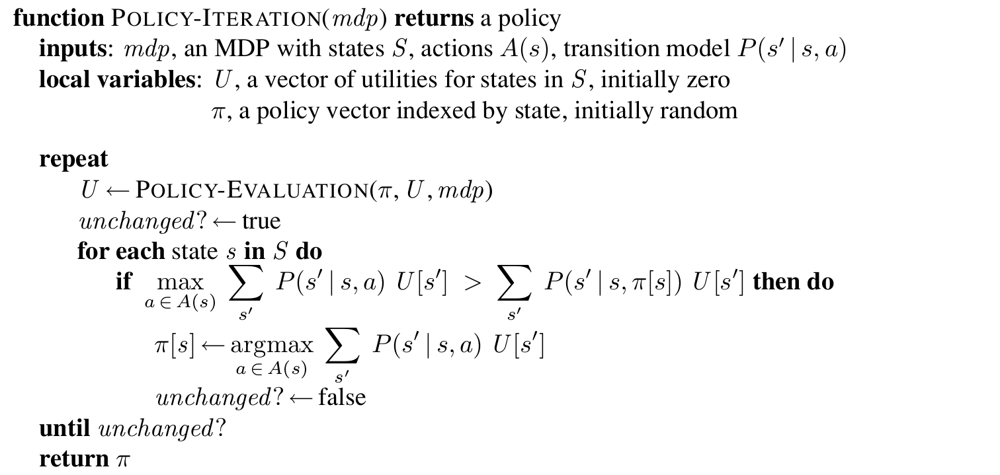]

---

class: middle
# Reinforcement learning

This section is a subset of the lecture

 https://glouppe.github.io/info8006-introduction-to-ai/?p=lecture9.md

by my colleague Professor G. Louppe.

---

# Content

How to make decisions under uncertainty, **while learning** about the environment?

.grid[
.kol-1-2[
- Reinforcement learning (RL)
- Passive RL
  - Model-based estimation
  - Model-free estimation
    - Direct utility estimation
    - Temporal-difference learning
- Active RL
  - Model-based learning
  - Q-Learning
  - Generalizing across states
]
.kol-1-2.width-100[   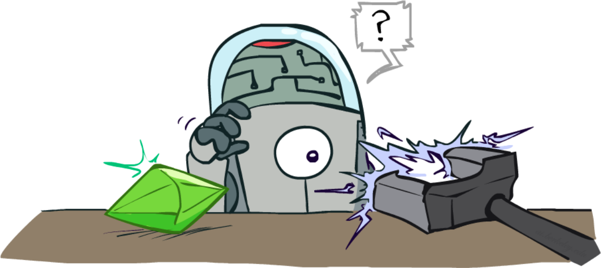]
]

.footnote[Image credits: [CS188](https://inst.eecs.berkeley.edu/~cs188/), UC Berkeley.]

---

class: middle

.width-100[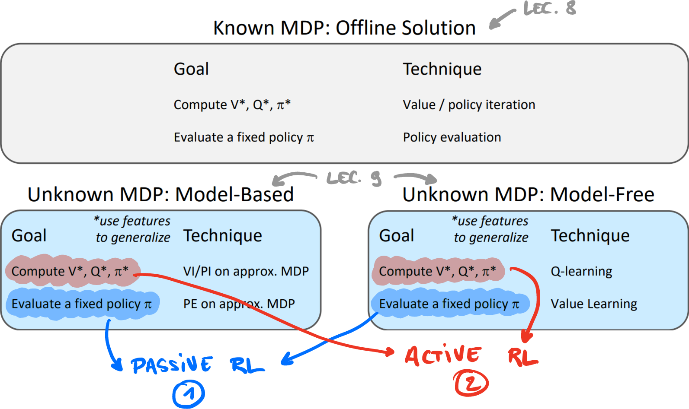]

.footnote[Image credits: [CS188](https://inst.eecs.berkeley.edu/~cs188/), UC Berkeley.]

???

Offline solution = Planning

---

class: middle

## Remark

- Although MDPs generalize to continuous state-action spaces, we assume in this lecture that both $\mathcal{S}$ and $\mathcal{A}$ are discrete and finite.

---

class: middle, black-slide

.center[
<video controls preload="auto" height="500" width="700">
  <source src="./figures/RL/chicken1.mp4" type="video/mp4">
</video>]

.footnote[Video credits: [Megan Hayes](https://twitter.com/PigMegan), [@YAWScience](https://twitter.com/YAWScience/status/1304199719036444672), 2020.]

---

class: middle 

## What just happened?

- This wasn't planning, it was reinforcement learning!
- There was an MDP, but the chicken couldn't solve it with just computation.
- The chicken needed to actually act to figure it out.

## Important ideas in reinforcement learning that came up
- Exploration: you have to try unknown actions to get information.
- Exploitation: eventually, you have to use what you know.
- Regret: even if you learn intelligently, you make mistakes.
- Sampling: because of chance, you have to try things repeatedly.
- Difficult: learning can be much harder than solving a known MDP.

???

There was a chicken, in some unknown MDP. The chicken wanted to maximise his reward.

---

# Reinforcement learning

We still assume a Markov decision process $(\mathcal{S}, \mathcal{A}, P, R)$ such that:
- $\mathcal{S}$ is a set of states $s$;
- $\mathcal{A}$ is a set of actions $a$;
- $P$ is a (stationary) transition model such that  $P(s'|s,a)$ denotes the probability of reaching state $s'$ if action $a$ is done in state $s$;
- $R$ is a reward function that maps immediate (finite) reward values $R(s)$ obtained in states $s$.

Our goal is find the optimal policy $\pi^\*(s)$.

---

class: middle

## New twist 

The transition model $P(s'|s,a)$ and the reward function $R(s)$ are **unknown**.
- We do not know which states are good nor what actions do!
- We must observe or interact with the environment in order  to jointly *learn* these dynamics and act upon them.
.grid[
.kol-1-5.center[
    
$$s'$$
$$r' = \underbrace{R(s')}\_{???}$$
]
.kol-3-5.center[
$$s$$
.width-90[]
$$s' \sim \underbrace{P(s'|s,a)}\_{???}$$
]
.kol-1-5[
     
$$a$$
]
]

???

Imagine playing a new game whose rules you don’t know; after a
hundred or so moves, your opponent announces, “You lose.” This is reinforcement learning
in a nutshell.

---

# Passive RL

.center.width-50[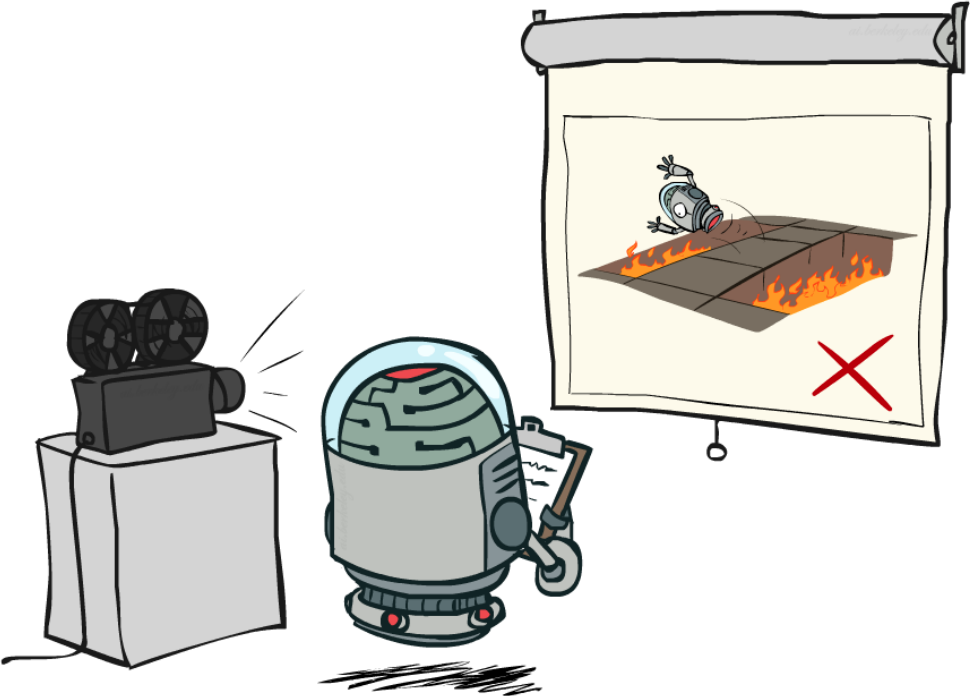]

## Goal: policy evaluation
- The agent's policy $\pi$ is fixed.
- Its goal is to learn the utilities $V^\pi(s)$.
- The learner has no choice about what actions to take. It just executes the policy and learns from experience.

.footnote[Image credits: [CS188](https://inst.eecs.berkeley.edu/~cs188/), UC Berkeley.]

???

This is not offline planning. You actually take actions in the world! (Since $P$ and $R$ are unknown)

---

class: middle

.center.width-30[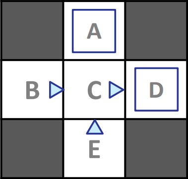]

The agent executes a set of **trials** (or episodes) in the environment using policy $\pi$.
Trial trajectories $(s, r, a, s'), (s', r', a', s''), ...$ might look like this:
- Trial 1: $(B, -1, \text{east}, C), (C, -1, \text{east}, D), (D, +10, \text{exit}, \perp)$
- Trial 2: $(B, -1, \text{east}, C), (C, -1, \text{east}, D), (D, +10, \text{exit}, \perp)$
- Trial 3: $(E, -1, \text{north}, C), (C, -1, \text{east}, D), (D, +10, \text{exit}, \perp)$
- Trial 4: $(E, -1, \text{north}, C), (C, -1, \text{east}, A), (A, -10, \text{exit}, \perp)$

---

# Model-based estimation

A **model-based** agent estimates approximate transition and reward models $\hat{P}$ and $\hat{R}$ based on experiences and then evaluates the resulting empirical MDP.

- Step 1: Learn an empirical MDP.
  - Estimate $\hat{P}(s'|s,a)$ from empirical samples $(s,a,s')$ (e.g with supervised learning).
  - Discover each $\hat{R}(s)$ for each $s$.
- Step 2: Evaluate $\pi$ using $\hat{P}$ and $\hat{R}$, e.g. as
  $$V(s)  = \hat{R}(s) + \gamma \sum\_{s'} \hat{P}(s'|s,\pi(s)) V(s').$$

.center.width-55[]

.footnote[Image credits: [CS188](https://inst.eecs.berkeley.edu/~cs188/), UC Berkeley.]

---

class: middle

## Example

.grid[
.kol-1-4.smaller-x[
Policy $\pi$:

.width-100[]
]
.kol-3-4[
.smaller-x[
Trajectories:
- $(B, -1, \text{east}, C), (C, -1, \text{east}, D), (D, +10, \text{exit}, \perp)$
- $(B, -1, \text{east}, C), (C, -1, \text{east}, D), (D, +10, \text{exit}, \perp)$
- $(E, -1, \text{north}, C), (C, -1, \text{east}, D), (D, +10, \text{exit}, \perp)$
- $(E, -1, \text{north}, C), (C, -1, \text{east}, A), (A, -10, \text{exit}, \perp)$

]
]
]

.grid.smaller-x[
.kol-1-2[
Learned transition model $\hat{P}$:
- $\hat{P}(C|B, \text{east}) = 1$
- $\hat{P}(D|C, \text{east}) = 0.75$
- $\hat{P}(A|C, \text{east}) = 0.25$
- (...)
]
.kol-1-2[
Learned reward $\hat{R}$:
- $\hat{R}(B) = -1$
- $\hat{R}(C) = -1$
- $\hat{R}(D) = +10$
- (...)
]
]

---

# Model-free estimation

Can we learn $V^\pi$ in a **model-free** fashion, without explicitly modeling the environment, i.e. without learning $\hat{P}$ and $\hat{R}$?

---

# Direct utility estimation

(a.k.a. Monte Carlo evaluation)

- The utility $V^\pi(s)$ of state $s$ is the expected total reward from the state onward (called the expected **reward-to-go**)
$$V^\pi(s) = \mathbb{E}\left[\sum\_{t=0}^\infty \gamma^t R(s\_t) \right]\Biggr\rvert\_{s\_0=s}$$
- Each trial provides a *sample* of this quantity for each state visited.
- Therefore, at the end of each sequence, one can update a sample average $\hat{V}^\pi(s)$ by:
  - computing the observed reward-to-go for each state;
  - updating the estimated utility for that state, by keeping a running average.
- In the limit of infinitely many trials, the sample average will converge to the true expectation.

---

class: middle

## Example ($\gamma=1$)

.grid[
.kol-1-4.smaller-x[
Policy $\pi$:

.width-100[]
]
.kol-3-4[
.smaller-x[
Trajectories:
- $(B, -1, \text{east}, C), (C, -1, \text{east}, D), (D, +10, \text{exit}, \perp)$
- $(B, -1, \text{east}, C), (C, -1, \text{east}, D), (D, +10, \text{exit}, \perp)$
- $(E, -1, \text{north}, C), (C, -1, \text{east}, D), (D, +10, \text{exit}, \perp)$
- $(E, -1, \text{north}, C), (C, -1, \text{east}, A), (A, -10, \text{exit}, \perp)$
]
]
]

.grid[
.kol-1-4.smaller-x[
Output values $\hat{V}^\pi(s)$:

.width-100[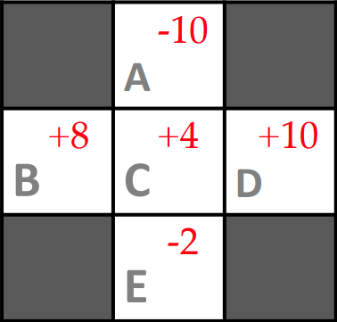]
]
.kol-3-4.center.italic[  

If both $B$ and $E$ go to $C$ under $\pi$,  how can their values be different?]
]

---

class: middle

Unfortunately, direct utility estimation misses the fact that the state values $V^\pi(s)$ are not independent, since they obey the Bellman equations for a fixed policy:
$$V^\pi(s) = R(s) + \gamma \sum\_{s'}P(s'|s,\pi(s)) V^\pi(s').$$
Therefore, direct utility estimation misses opportunities for learning and takes a long time to learn.

---

# Temporal-difference learning

Temporal-difference (TD) learning consists in updating $V^\pi(s)$ each time the agent experiences a transition $(s, r=R(s), a=\pi(s), s')$.

.width-20.center[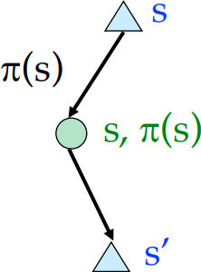]

When a transition from $s$ to $s'$ occurs, the temporal-difference update steers $V^\pi(s)$ to better agree with the Bellman equations for a fixed policy, i.e.
$$V^\pi(s) \leftarrow V^\pi(s) + \alpha \underbrace{(r + \gamma V^\pi(s') - V^\pi(s))}\_{\text{temporal difference error}}$$
where $\alpha$ is the *learning rate* parameter.

???

Instead waiting for a complete trajectory to update $V^\pi(s)$, ...

...

- If $r + \gamma V^\pi(s') > V^\pi(s)$ then the prediction $V^\pi(s)$ underestimates the value, hence the increment.
- If $r + \gamma V^\pi(s') < V^\pi(s)$ then the prediction $V^\pi(s)$ overestimates the value, hence the decrement.

---

class: middle

Alternatively, the TD-update can be viewed as a single gradient descent step on the squared error between the target $r+ \gamma V^\pi(s')$ and the prediction $V^\pi(s)$. (More later.)

---

class: middle

## Exponential moving average

The TD-update can equivalently be expressed as the exponential moving average
$$V^\pi(s) \leftarrow (1-\alpha)V^\pi(s) + \alpha (r + \gamma V^\pi(s')).$$

Intuitively,
- this makes recent samples more important;
- this forgets about the past (distant past values were wrong anyway).
  
---

class: middle 

## Example ($\gamma=1$, $\alpha=0.5$)

.grid[
.kol-1-4[]
.kol-1-2.center[.width-45[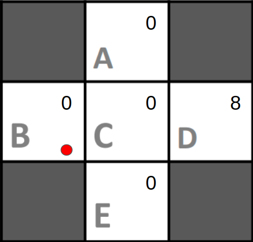] .width-45[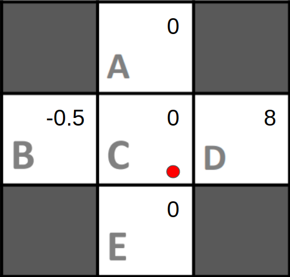]

Transition: $(B, -1, \text{east}, C)$
]
]

TD-update:

$\begin{aligned}
V^\pi(B) &\leftarrow V^\pi(B) + \alpha(R(B) + \gamma V^\pi(C) - V^\pi(B)) \\\\
&\leftarrow 0 + 0.5 (-1 + 0 - 0) \\\\
&\leftarrow -0.5
\end{aligned}$

---

class: middle

.grid[
.kol-1-4[]
.kol-1-2.center[.width-45[] .width-45[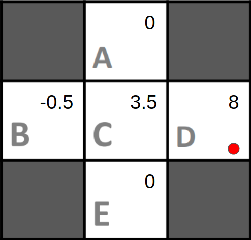]

Transition: $(C, -1, \text{east}, D)$
]
]

TD-update:

$\begin{aligned}
V^\pi(C) &\leftarrow V^\pi(C) + \alpha(R(C) + \gamma V^\pi(D) - V^\pi(C)) \\\\
&\leftarrow 0 + 0.5 (-1 + 8 - 0) \\\\
&\leftarrow 3.5
\end{aligned}$

???

Note how the large reward eventually propagates back to the states leading to it. 

Doing the first update again would result in a better value for $B$.

---

class: middle

## Convergence

- Notice that the TD-update involves only the observed successor $s'$, whereas the actual Bellman equations for a fixed policy involves all possible next states. Nevertheless, the *average* value of $V^\pi(s)$ will converge to the correct value.
- If we change $\alpha$ from a fixed parameter to a function that decreases as the number of times a state has been visited increases, then $V^\pi(s)$  will itself converge to the correct value.

---

# Active RL

.center.width-80[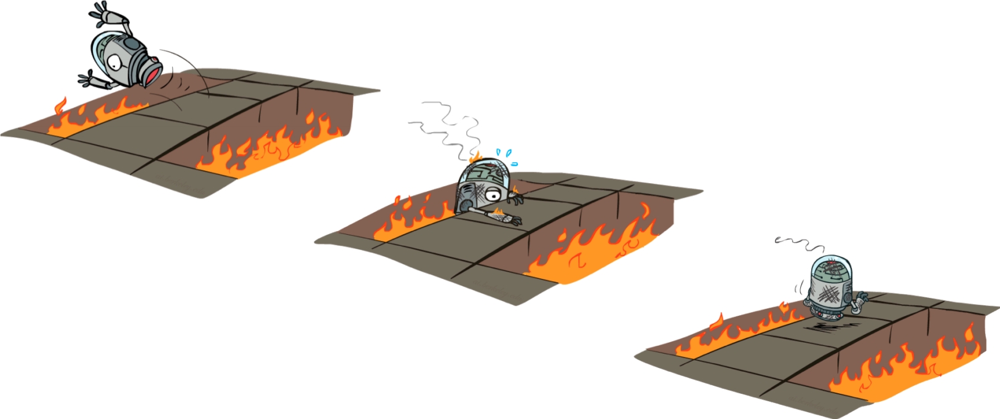]

## Goal: learn an optimal policy
- The agent's policy is not fixed anymore.
- Its goal is to learn the optimal policy $\pi^\*$ or the state values $V(s)$.
- The learner makes choices!
- Fundamental trade-off: exploration vs. exploitation.

.footnote[Image credits: [CS188](https://inst.eecs.berkeley.edu/~cs188/), UC Berkeley.]

---

# Model-based learning

The passive model-based agent can be made active by instead finding the optimal policy $\pi^*$ for the empirical MDP.

For example, having obtained a utility function $V$ that is optimal for the learned model (e.g., with Value Iteration), the optimal action by one-step look-ahead to maximize the expected utility is
$$\pi^*(s) = \arg \max\_a \sum\_{s'} \hat{P}(s'|s,a) V(s').$$

---

class: middle, center

.width-100[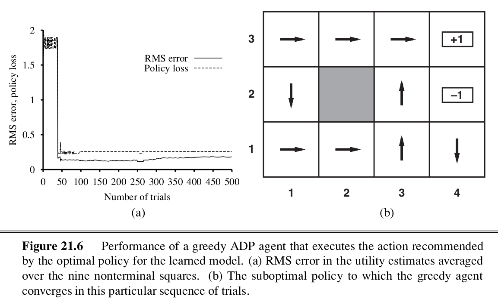]

The agent **does not** learn the true utilities or the true optimal policy!

---

class: middle

The resulting is **greedy** and **suboptimal**:
- The learned transition and reward models $\hat{P}$ and $\hat{R}$ are not the same as the true environment.
- Therefore, what is optimal in the learned model can be suboptimal in the true environment.

---

# Exploration

Actions do more than provide rewards according to the current learned model. 
They also contribute to learning the true environment. 

This is the **exploitation-exploration** trade-off:
- Exploitation: follow actions that maximize the rewards, under the current learned model;
- Exploration: follow actions to explore and learn about the true environment.

.center.width-60[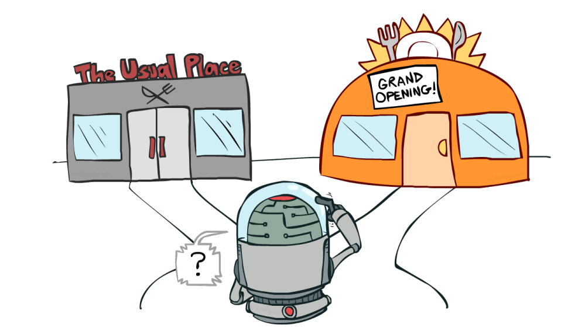]

.footnote[Image credits: [CS188](https://inst.eecs.berkeley.edu/~cs188/), UC Berkeley.]

---

class: middle 

## How to explore?

Simplest approach for forcing exploration: random actions ($\epsilon$-greedy).
- With a (small) probability $\epsilon$, act randomly.
- With a (large) probability $(1-\epsilon)$, follow the current policy.

$\epsilon$-greedy does eventually explore the space, but keeps trashing around once learning is done.

---

class: middle 

## When to explore?

Better idea: explore areas whose badness is not (yet) established, then stop exploring.

Formally, let $V^+(s)$ denote an optimistic estimate of the utility of state $s$ and let $N(s,a)$ be the number of times actions $a$ has been tried in $s$. 

For Value Iteration, the update equation becomes
$$V^+\_{i+1}(s) = R(s) + \gamma \max\_a f(\sum_{s'} P(s'|s,a) V^+\_i(s'), N(s,a)),$$
where $f(v, n)$ is called the **exploration function**. 

The function $f(v,n)$ should be increasing in $v$ and decreasing in $n$. A simple choice is $f(v,n) = v + K/n$.

???

This is similar to MCTS! (Lecture 3)

---

# Model-free learning

Although temporal difference learning provides a way to estimate $V^\pi$ in a model-free fashion, we would still have to learn a model $P(s'|s,a)$ to choose an action based on a one-step look-ahead.

 
.center.width-50[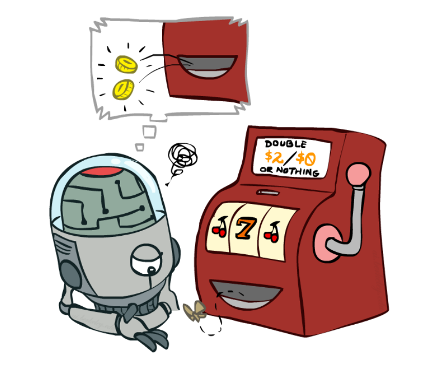]

.footnote[Image credits: [CS188](https://inst.eecs.berkeley.edu/~cs188/), UC Berkeley.]

---

# Détour: Q-values

.grid[
.kol-1-2[
- The state-value $V(s)$ of the state $s$ is the expected utility starting in $s$ and acting optimally.
- The state-action-value $Q(s,a)$ of the q-state $(s,a)$ is the expected utility starting out having taken action $a$ from $s$ and thereafter acting optimally.
]
.kol-1-2.width-100[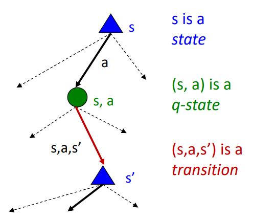]
]

---

class: middle

## Optimal policy

The optimal policy $\pi^\*(s)$ can be defined in terms of either $V(s)$ or $Q(s,a)$:
$$\begin{aligned}
\pi^\*(s) &= \arg \max\_a \sum\_{s'} P(s'|s,a) V(s') \\\\
&= \arg \max\_a Q(s,a)
\end{aligned}$$

.footnote[Image credits: [CS188](https://inst.eecs.berkeley.edu/~cs188/), UC Berkeley.]

---

class: middle

## Bellman equations for $Q$

Since $V(s) = \max\_a Q(s,a)$, the Q-values $Q(s,a)$ are recursively defined as
$$\begin{aligned}
Q(s,a) &= R(s) + \gamma \sum\_{s'} P(s'|s,a) V(s') \\\\
&= R(s) + \gamma \sum\_{s'} P(s'|s,a) \max\_{a'} Q(s',a').
\end{aligned} $$

As for value iteration, the last equation can be used as an update equation for a fixed-point iteration procedure that calculates the Q-values $Q(s,a)$. However, it still requires knowing $P(s'|s,a)$!

---

# Q-Learning

The state-action-values $Q(s,a)$ can be learned in a model-free fashion using a temporal-difference method known as **Q-Learning**.

Q-Learning consists in updating $Q(s,a)$ each time the agent experiences a transition $(s, r=R(s), a, s')$.

The update equation for TD Q-Learning is
$$Q(s,a) \leftarrow Q(s,a) + \alpha (r + \gamma \max\_{a'} Q(s',a') - Q(s,a)).$$

.alert[Since $\pi^*(s) = \arg \max\_a Q(s,a)$, a TD agent that learns Q-values does not need a model of the form $P(s'|s,a)$, neither for learning nor for action selection!]

---

class: middle

.width-100[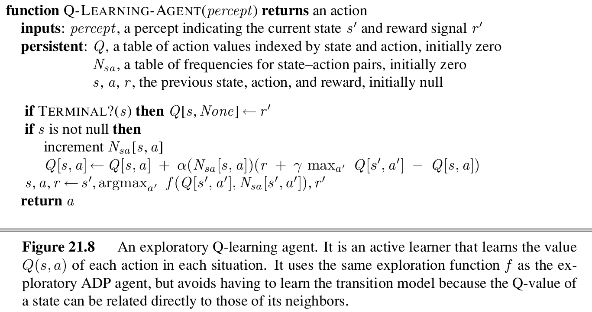]

---

class: middle

.width-30.center[]

## Convergence

Q-Learning **converges to an optimal policy**, even when acting suboptimally.
- This is called off-policy learning.
- Technical caveats:
  - You have to explore enough.
  - The learning rate must eventually become small enough.
  - ... but it shouldn't decrease too quickly.

.footnote[Image credits: [CS188](https://inst.eecs.berkeley.edu/~cs188/), UC Berkeley.]

---

# Generalizing across states

.grid[
.kol-2-3[
- Basic Q-Learning keeps a table for all Q-values $Q(s,a)$.
- In realistic situations, we cannot possibly learn about every single state!
  - Too many states to visit them all in training.
  - Too many states to hold the Q-table in memory.
- We want to generalize:
  - Learn about some small number of training states from experience.
  - Generalize that experience to new, similar situations.
  - This is supervised *machine learning* again!
]
.kol-1-3.width-100[  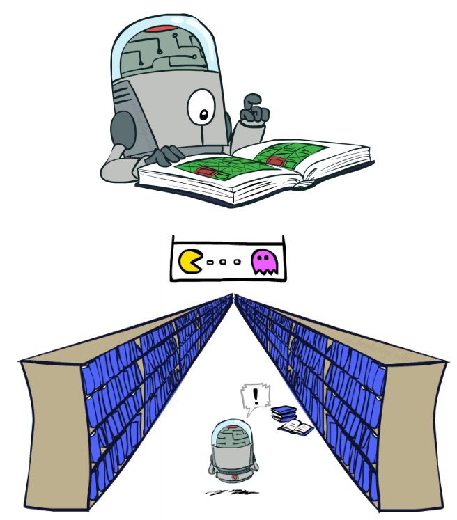]
]

.footnote[Image credits: [CS188](https://inst.eecs.berkeley.edu/~cs188/), UC Berkeley.]

---

class: middle

## Example: Pacman
.grid.center[
.kol-1-8[]
.kol-1-4[(a)

.width-100[]]
.kol-1-4[(b)

.width-100[]]
.kol-1-4[(c)

.width-100[]]
.kol-1-8[]
]

If we discover by experience that (a) is bad, then in naive Q-Learning, we know nothing about (b) nor (c)!

.footnote[Image credits: [CS188](https://inst.eecs.berkeley.edu/~cs188/), UC Berkeley.]

---

class: middle 

.grid[
.kol-3-4[
## Feature-based representations

Solution: describe a state $s$ using a vector $\mathbf{x} = [f\_1(s), ..., f\_d(s)] \in \mathbb{R}^d$ of features.
- Features are functions $f\_k$ from states to real numbers that capture important properties of the state.
- Example features:
  - Distance to closest ghost
  - Distance to closest dot
  - Number of ghosts
  - ...
- Can similarly describe a q-state $(s, a)$ with features $f\_k(s,a)$.
]
.kol-1-4.width-100[]
]

.footnote[Image credits: [CS188](https://inst.eecs.berkeley.edu/~cs188/), UC Berkeley.]

---

class: middle

.center.width-50[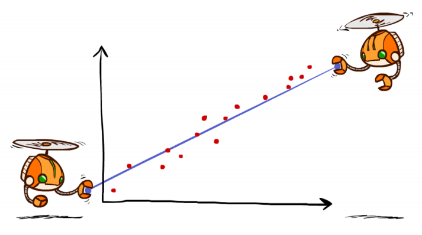]

## Approximate Q-Learning

Using a feature-based representation, the Q-table can now be replaced with a function approximator, such as a linear model:
$$Q(s,a) = w\_1 f\_1(s,a) + w\_2 f\_2(s,a) + ... + w\_d f\_d(s,a).$$

Upon the transition $(s, r, a, s')$, the update becomes
$$
w\_k \leftarrow  w\_k + \alpha (r + \gamma \max\_{a'} Q(s', a') - Q(s,a)) f\_k(s,a),
$$
for all $w\_k$.

.footnote[Image credits: [CS188](https://inst.eecs.berkeley.edu/~cs188/), UC Berkeley.]

???

Remember that the TD-update can be viewed as a online GD update, except now we dot not directly modify $Q(s,a)$ but rather the parameters of the function approximator.

---

class: middle

In linear regression, imagine we had only one point $\mathbf{x}$ with features $[f\_1, ..., f\_d]$. Then,
$$
\begin{aligned}
\ell(\mathbf{w}) &= \frac{1}{2} \left( y - \sum\_k w\_k f\_k \right)^2 \\\\
\frac{\partial \ell}{\partial w\_k} &= -\left(y -  \sum\_k w\_k f_k \right) f\_k \\\\
w\_k &\leftarrow w\_k + \alpha \left(y -  \sum\_k w\_k f\_k \right) f\_k,
\end{aligned}
$$

hence the Q-update
$$w\_k \leftarrow w\_k + \alpha \left(\underbrace{r + \gamma \max\_{a'} Q(s', a')}\_{\text{target}\, y} -  \underbrace{Q(s,a)}\_{\text{prediction}} \right) f\_k(s,a).$$

---

class: middle

## DQN

Similarly, the Q-table can be replaced with a neural network as function approximator, resulting in the *DQN* algorithm.

.center.width-100[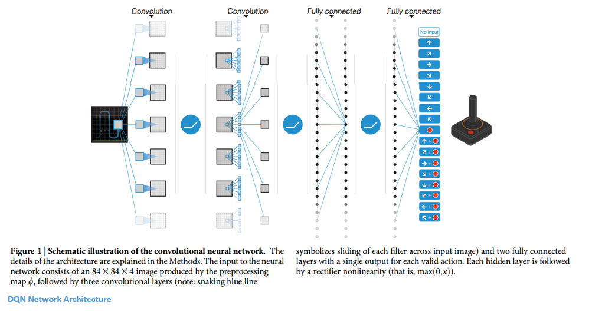]

---

class: middle
# Lifelong learning

---

# Problem statement

We consider an off-grid microgrid with a storage system, PV generation, a diesel generator, and some consumption.

Changes that can occur are 
- either gradual: PV degradation, demand growth
- or abrupt: device not responding.

A simulator of the system is used to train a control policy off-line.

Time steps of one-hour, several months of data available (PV and load).
.center.width-100[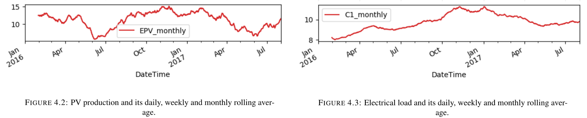]

---
# Microgrid MDP

.center.width-100[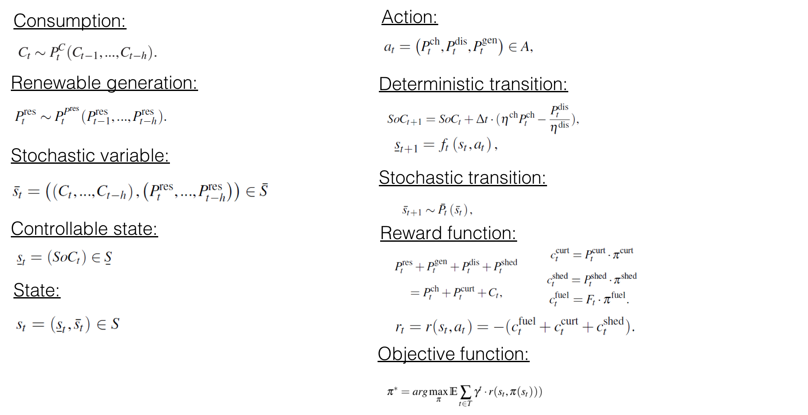]

---

# The proposed algorithm *D-Dyna* 

.center.width-60[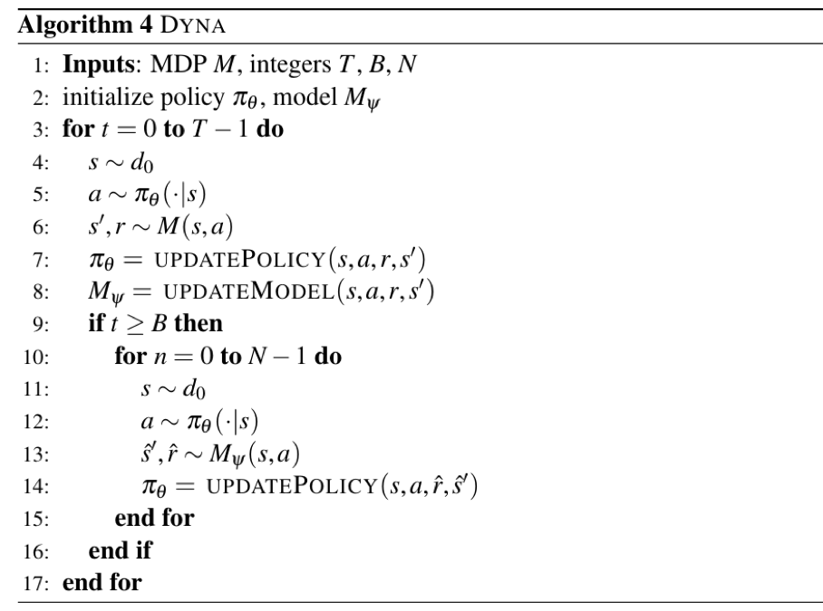]
 - Standard RL optimization where the policy is updated using samples collected from interaction with the real environment.
 - Plus a loop where the policy is updated by samples collected by a *model of the environment*.

---

# Model and policy updates

.grid[
.kol-1-2[
.center.width-90[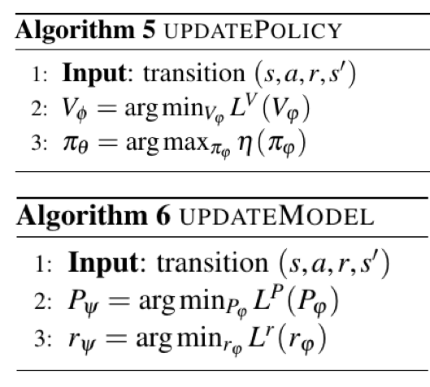]
]
.kol-1-2[
Algo 5: The policy update was performed with the proximal policy optimization *PPO* algorithm.]

  
Algo 6: The model of the environment is fitted with a regressor using states and reward samples collected from the real environment.
A quantile regressor was used as a model and was trained with distributional losses.
]

---

# Implementation tricks

Although there has been some progress in RL algorithms and function approximators, this problem is still challenging.

The problem is further simplified to consider meta-actions: 
   - start-stop a generator, charge or discharge a battery
   - relying on simple rules to derive precise set-points.

---

# El Espino microgrid

.center.width-100[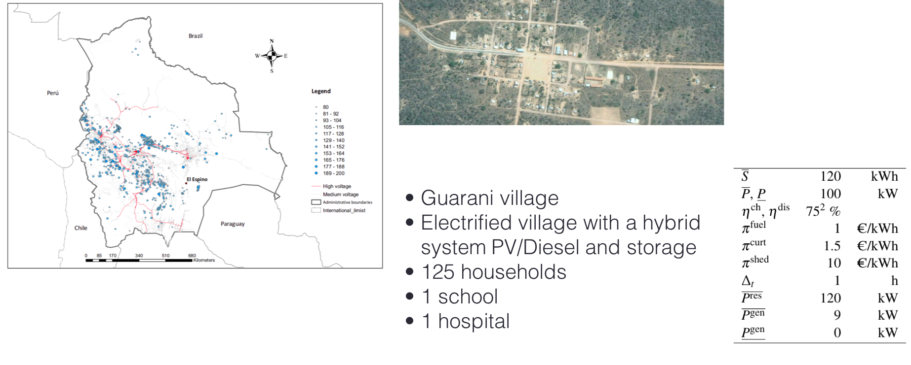]

---

# Benchmarks

The policy learned with D-Dyna is compared to 
1. *Heuristic*: a myopic rule based controller (lower bound)
2. *MPC-1h*: an optimization-based controller with perfect foresight over 1 hour
3. *MPC-24h*: an optimization-based controller with perfect foresight over 24 hours (upper bound)
4. "vanilla" *PPO*: model-free RL, to see the benefits from using a model 

---

# Test 1: Generalization

- We use the first year 2016 of the dataset for training and we evaluate on the second year 2017
.center.width-100[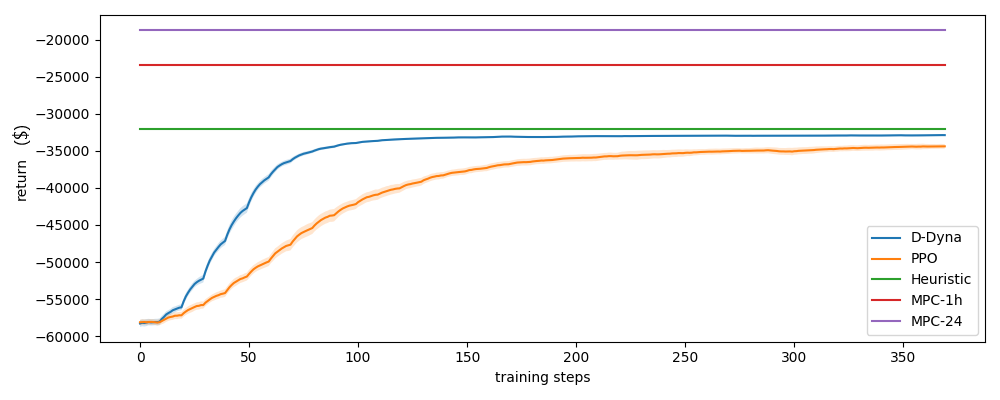]
- 25% cost reduction w.r.t. heurisitc controller
- Comparable performance to MPC-24h

---

# Test 2: Robustness

- Abrupt failure of the storage system (not known by any model!)
.center.width-100[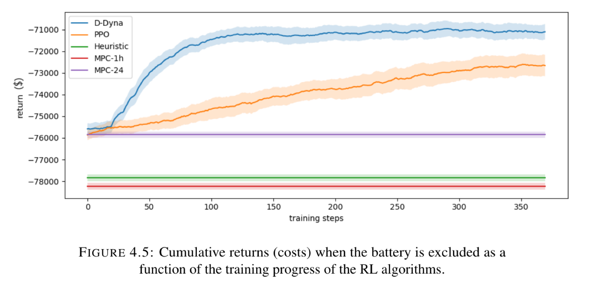]
- D-Dyna can detect change since the model has been exposed to similar incidents during training.
- Heuristic, MPC-1h, MPC-24h cannot adapt since no mechanism to detect or handle failure.

---

# Test 3: Transfer

Transfer learning is the ability of speeding up learning on new MDPs by reusing past experiences between similar MDPs
.center.width-100[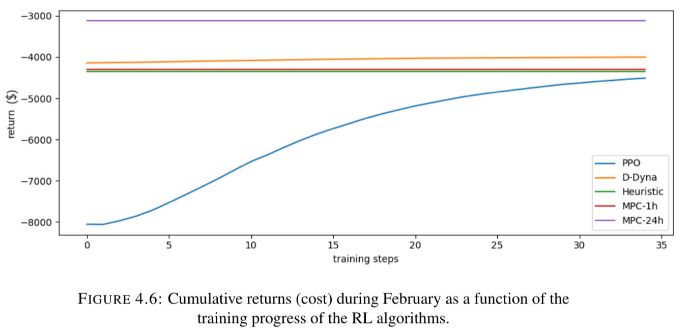]
- Jan. 2016 to pre-train the algorithms. Then we initiate the training process for Feb. and Aug. 2016 using the pre-trained model.
- Better performance than learning from scratch (compare D-Dyna to PPO)

---

.center.width-100[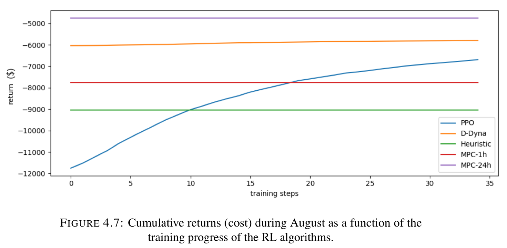]

- In contrast to February where the two policies perform similarly, in August the solar irraditation is limited (south-hemisphere). 
- This amplifies the difference between a naïve controller and a good look-ahead policy

---

# Conclusion

- Learned explicitely a control policy that can be transferred to a new setup with mild adaptations
- robust to changes in the system

- Learning a policy with continuous actions as future work
- There is still a lot to be done to apply to larger systems

---

class: end-slide, center
count: false

The end.
